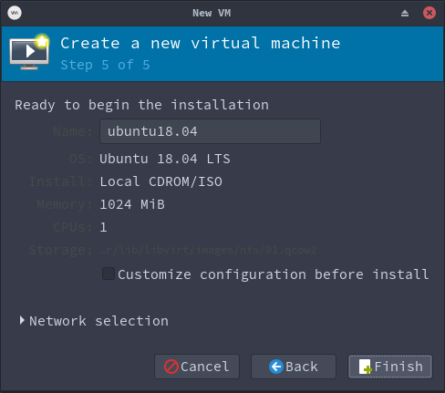

# 分布式系统第二次作业

小组人员：

- 16337085
- 1633

# 实验要求

# 实验原理

动态迁移就是在保证虚拟机上服务正常运行的同时，将一个虚拟机系统从一个物理主机移动到另一个物理主机的过程。该过程不会对最终用户造成明显的影响，从而使得管理员能够在不影响用户正常使用的情况下，对物理服务器进行离线维修或者升级。与静态迁移不同的是，为了保证迁移过程中虚拟机服务的可用，迁移过程仅有非常短暂的停机时间。迁移的前面阶段，服务在源主机的虚拟机上运行，当迁移进行到一定阶段，目的主机已经具备了运行虚拟机系统的必须资源，经过一个非常短暂的切换，源主机将控制权转移到目的主机，虚拟机系统在目的主机上继续运行。对于虚拟机服务本身而言，由于切换的时间非常短暂，用户感觉不到服务的中断，因而迁移过程对用户是透明的。动态迁移适用于对虚拟机服务可用性要求很高的场合。

目前主流的动态迁移工具，VMware 的 VMotion，Citrix 的 XenMotion，他们都依赖于物理机之间采用 SAN（storage area network）或 NAS（network-attached storage）之类的集中式共享外存设备，因而在迁移时只需要进行虚拟机系统内存执行状态的迁移，从而获得较好的迁移性能。

本实验用的是virt-manager程序自带的迁移

# 实验前准备

## 实验器材

一共三台装有Linux系统的电脑。源主机用的是Arch系统，目标主机用的是Ubuntu系统，NFS服务器用的是Ubuntu系统。

## 实验软件

- virt-manager
- nfsserver

# 实验过程

## 搭建NFS服务器

## 建立虚拟机

1. 添加 NFS 存储池到源主机的virt-manager中

2. 源主机上创建建立在NFS共享存储上的虚拟机

3. 在虚拟机中使用iso镜像文件安装系统

## 在目标主机上的连接

1. 添加 NFS 存储池到目标主机的virt-manager中
2. 开启ssh服务

## 迁移虚拟机

1. 在源主机上开启虚拟机
2. 在源主机的virt-manager中连接到目标主机

3. 待开机完成后迁移虚拟机

# 实验结论

做不出来

# 遇到的问题

## 1. 装在NFS上的虚拟机运行速度很慢

当时装个Ubuntu系统都用了一个多小时，装好之后虚拟机每一次开机都需要20分钟以上的时间。瓶颈可能是网络传输速度过低和硬盘相应延时。每一次重启虚拟机要花费半个小时以上的时间，这个时间太长，让人无法接受。

## 2. host CPU does not provide required features

换了不同的电脑，重头再次创建虚拟机，最后还是会遇到这个错误，不过required features后面的报错信息略有区别。尝试安装intel -ucode后更新配置文件并重启，仍然无法解决问题。

#参考资料

- [KVM virtual machine mirgration tutorials](https://www.linux-kvm.org/page/Migration)
- https://blog.csdn.net/taiyang1987912/article/details/47973479
- https://www.ibm.com/developerworks/cn/linux/l-linux-kvm/index.html    
- https://www.ibm.com/developerworks/cn/linux/l-cn-mgrtvm2/index.html
- http://www.cnblogs.com/liuyansheng/p/5985633.html
- https://www.ibm.com/developerworks/cn/linux/l-cn-mgrtvm2/index.html